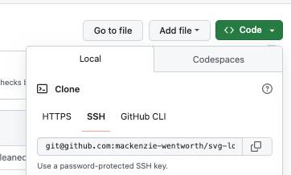
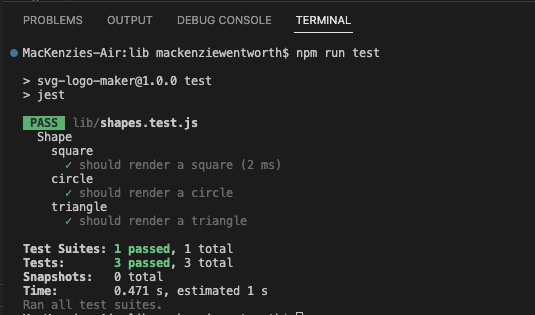
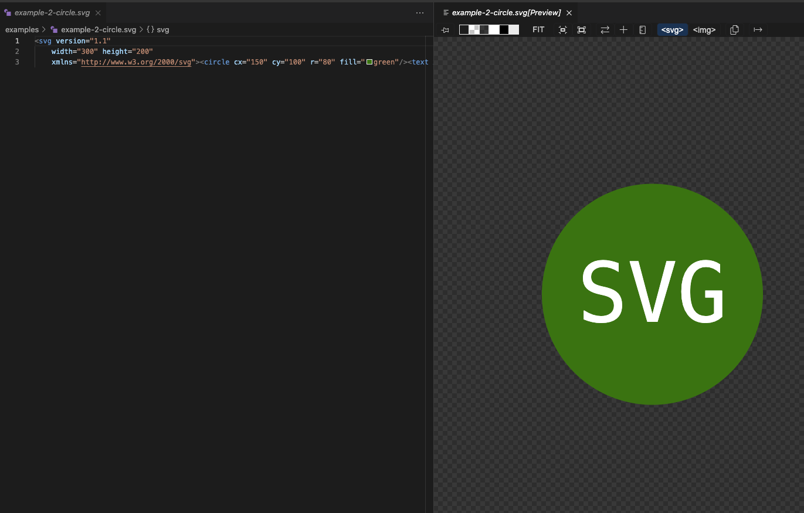

# SVG Shape Logo Maker

## Link to GitHub Repository: 
To view the GitHub repository for "SVG Shape Logo Maker", please visit the following link: https://github.com/mackenzie-wentworth/svg-logo-maker


## Description
Need help creating a logo for your project, brand, or profile? With this *SVG Shape Logo Maker*, you can quickly generate a clean and simple logo by following a series of prompts to pick the shape, colors, and text that you desire through the command line. 

Please continue to the following sections for instructions to use the SVG Shape Logo maker so that you can generate your own logo in `.svg` format. Let's get started!

---

## Installation
In order to utilize the SVG Shape Logo Maker for your own use, please be sure you have the following already installed:
* An open source code editor, such as [VS Code](https://code.visualstudio.com/)
* [Git Bash](https://www.educative.io/answers/how-to-install-git-bash-in-windows) or [Zsh](https://github.com/ohmyzsh/ohmyzsh/wiki/Installing-ZSH) (to use in [Git](https://github.com/git-guides/install-git) command line)
* [Node.js](https://nodejs.org/en)
* [SVG extension](https://marketplace.visualstudio.com/items?itemName=jock.svg)

This project also uses the software packages: **Node Package Manager**, **Inquirer**, and **Jest**. Please see the steps below to install these packages so that you can finish setting up your environment. 


### *Steps to Set Up Environment:*
1. From within the "SVG Shape Logo Maker" respository on GitHub, click the "Code" button and copy the `SSH URL` to your clipboard.

    

2. Using the command line in your terminal, type the following `git clone` command and paste the `SSH URL` you just copied:  

    ```bash
        git clone [github ssh url]
    ```

3. Open the cloned "SVG Shape Logo Maker" repository in VS Code. Then within VS Code, open a new terminal and type the following `npm` command to install the [Node Package Manager](https://www.npmjs.com/):

    ```bash
        npm init -y
    ```

4. Next, type in the following `npm` command to install the npm [Inquirer Package](https://www.npmjs.com/package/inquirer):

    ```bash
        npm i inquirer@8.2.4
    ```

5. Next, type in the following `npm` command to install the npm [Jest Package](https://www.npmjs.com/package/jest):

    ```bash
        npm i jest
    ```

---

## Usage
After you've installed all necessary packages, you are now ready to start creating your own logo by generating an `.svg` file! Please continue to the instructions and demonstration video below. 

### *How to Use SVG Shape Logo Maker:*
1. In VS Code, right-click on the `shapes.test.js` file from the directory menu to 'open in integrated terminal.'

2. In the terminal, type the following `npm` command to execute `Jest` unit testing so that we can verify the application is functioning correctly:

    ```bash
        npm run test
    ```
    >**NOTE**: Your terminal should return the following:
    

3. Once you've verified that all tests return `PASS` and green in the terminal, next right-click on the `index.js` file from the directory menu to 'open in integrated terminal.' This will put you in the right file path to run the proceeding `node.js` commands.

4. In the terminal, type the following `node.js` command:

    ```bash
        node index.js
    ```

5. You will then be greeted to follow a series of prompts so that you can input required details for your logo.  

    >**NOTE**: If you would like to use uppercase letters for the text of your logo, please be sure to input your answer in uppercase. 

6. Once you've answered all prompts in the terminal, click on the `logo.svg` file within the directory menu to view your new generated logo.

### *Video Demonstration:*
[Watch demo video here!](https://user-images.githubusercontent.com/122484637/229916628-d07fb780-b10a-48ae-b8b0-f74d885fe7de.webm)

### *SVG Shape Logo Example:*
The following image demonstrates an example of the logo style you can create using the SVG Shape Logo Maker: 




### *Want To Add More Effects To Your SVG Logo?:*
If you'd like to add more features to your logo, please visit the following resource: 
* MDN Web Docs - https://developer.mozilla.org/en-US/docs/Web/SVG/Tutorial

---

## Questions?
If you have any questions, please see my contact information below to reach me for inquiries:
* **GitHub**: mackenzie-wentworth, at https://github.com/mackenzie-wentworth
* **Email**: mwentworth28@gmail.com
